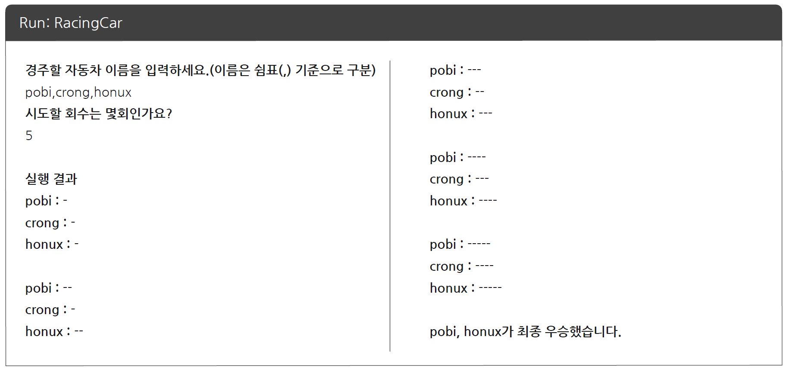

# Precourse Week 2 - 자동차 경주 게임

## 미션 요구사항

> ### 기능 요구사항
>
> 1. 주어진 횟수 동안 n대의 자동차는 전진 또는 멈출 수 있다.
>
> 2. 각 자동차에 이름을 부여할 수 있다. 전진하는 자동차를 출력할 때 자동차 이름을 같이 출력한다.
>
> 3. 자동차 이름은 쉼표(,)를 기준으로 구분하며 이름은 5자 이하만 가능하다.
>
> 4. 사용자는 몇 번의 이동을 할 것인지를 입력할 수 있어야 한다.
>
> 5. 전진하는 조건은 0에서 9 사이에서 random 값을 구한 후 random 값이 4 이상일 경우 전진하고, 3 이하의 값이면 멈춘다.
>
> 6. 자동차 경주 게임을 완료한 후 누가 우승했는지를 알려준다. 우승자는 한 명 이상일 수 있다.

> ### 프로그램 실행 결과
>
> 

> ### 프로그래밍 요구사항
>
> #### 객체
>
> 1. 다음 Car 객체를 활용해 구현해야 한다.
>
> 2. Car 기본 생성자를 추가할 수 없다.
>
> 3. name, position 변수의 접근 제어자인 private를 변경할 수 없다.
>
> 4. 가능하면 setPosition(int position) 메소드를 추가하지 않고 구현한다.
>
> ```java
> public class Car {
>     private final String name;
>     private int position = 0;
>
>     public Car(String name) {
>         this.name = name;
>     }
>
>     // 추가 기능 구현
> }
> ```
>
> #### 1주차와 동일
>
> 1. 3항 연산자를 쓰지 않는다.
>
> 2. indent(인덴트, 들여쓰기) depth를 3이 넘지 않드록 구현한다. 2까지만 허용된다.
>
>    - 힌트 : indent depth를 줄이는 좋은 방법은 함수(또는 메소드)를 분리하면 된다.
>
> #### 2주차 변경 및 추가
>
> 1. 자바 코드 컨벤션을 지키면서 프로그래밍한다.
>
>    - [캠퍼스 핵데이 자바 코딩 컨벤션 참고](https://naver.github.io/hackday-conventions-java/)
>
> 2. 함수(또는 메소드)의 길이가 15라인을 넘지 않도록 구현한다.
>
>    - 함수(또는 메소드)가 한 가지 일만 잘 하도록 구현한다.
>
> 3. else 예약어를 쓰지 않는다.
>
>    - 힌트 : if 조건절에서 값을 return하는 방식으로 구현하면 else를 사용하지 않아도 된다.
>
>    - else를 쓰지 말라고 하니 switch/case로 구현하는 경우가 있는데, switch/case도 허용하지 않는다.

<br>

## 구현해야 할 기능 목록

1. (기능 3) 사용자로부터 **쉼표(,)를 기준**으로 구분 지어진 자동차의 이름들을 입력받는 기능. **-구현 완료-**

   - ~~(구현) 사용자로부터 입력을 한 줄 단위(Enter 입력 전까지)로 받고, 입력에서 쉼표(,)의 앞, 뒤에 존재하는 공백을 제거하는 기능.~~

     - (수정) 쉼표(,)를 기준으로 문자열을 먼저 자른 후 구분된 문자열의 앞, 뒤에 존재하는 공백을 없애는 형식으로 변경.

   - (예외) 쉼표(,)를 기준으로 문자열을 split하고, 구분된 문자열 각각의 길이가 **1보다 작거나 5보다 큰지** 확인.

   - (예외) 구분된 문자열의 **각 자리가 숫자 또는 문자인지** 확인.

   - (예외) 동일한 자동차의 이름이 중복되어 입력된 경우가 있는지 확인.

   - (구현) 자동차의 이름들이 모두 유효성을 통과할 경우, 자동차 이름들을 List에 저장하는 기능.

2. (기능 1) 사용자로부터 입력받은 자동차 이름들로 자동차 객체를 생성하는 기능. **-구현 완료-**

3. (기능 4) 사용자로부터 자동차의 시도 횟수를 입력받는 기능. **-구현 완료-**

   - (예외) 입력된 숫자가 **0보다 큰 정수**인지 확인.

4. (기능 5) 각각의 자동차들이 0에서 9 사이의 random 한 숫자를 생성하는 기능. **-구현 완료-**

5. (기능 5) 자동차의 random 한 수가 **3 이하인지, 4 이상인지 확인하여 전진 여부를 판단**하는 기능. **-구현 완료-**

6. (기능 5) 자동차가 전진해야 할 경우, 해당 자동차의 position을 이동시키는 기능. **-구현 완료-**

   - (구현) 모든 자동차들의 position 중 최댓값을 저장하는 변수의 값보다 해당 자동차의 이동한 후 position이 클 경우, 해당 변수의 값을 초기화하는 기능.

7. (기능 2) 모든 자동차들의 이동이 끝난 후의 **위치를 이름과 함께 출력**하는 기능. **-구현 완료-**

8. (기능 1) 위 3 ~ 6까지의 기능들을 **입력받은 횟수(n번)만큼 반복**하는 기능. **-구현 완료-**

9. (기능 6) 모든 이동이 끝나고, position들 중 최대값이 저장되어 있는 변수의 값과 비교하여 동일한 position을 가지는 자동차들을 선택하는 기능. **-구현 완료-**

10. (기능 6) 선택된 모든 자동차들의 이름을 쉼표(,)로 구분하여 출력하는 기능(**중복 허용**). **-구현 완료-**

    - (예외) 모든 자동차들이 출발선에 위치할 경우, 우승자가 존재하지 않는다는 출력을 하는 기능.

<br>

## 개발 진행 계획

1. 어떤 프로젝트인지와 [구현해야 할 기능](##-구현해야-할-기능-목록)을 대략적으로 작성.

   - 과제의 진행에 필요한 내용들을 [README.md](./README.md)에서 모두 볼 수 있도록 작성.

2. [구현해야 할 기능 목록](##-구현해야-할-기능-목록)에 대한 세부적인 기능 재분류 및 예외 처리 작성.

   - 구현 방법과 예외 처리에 대한 간략한 설명 및 계획 추가.

   - 클래스의 분리에 초점을 둬서 어떤 기능들을 어떤 클래스로 분류해야 할지 고민 후 간략하게 작성.

3. [구현해야 할 기능 목록](##-구현해야-할-기능-목록) 순서대로 Class 생성 및 코드 작성 (기능의 함수화).

   - 구현해야 할 기능에 따른 Class 설정.

   - 최대한 Code Conventions를 지키면서 작성(명명에도 신경쓰기).

4. 1차 전체적인 리펙토링 진행 ([프로그래밍 요구 사항](###-프로그래밍-요구사항)을 중점적으로 진행).

   - 전체 코드를 검토, 재확인하면서 기능을 좀 더 세분화시켜 [함수화](####-2주차-변경-및-추가)하는 리펙토링 진행.

   - [Car 객체](####-객체)의 활용 확인 (setPosition 메소드 사용하지 않았는지 확인).

   - 상수가 사용되지 않은 부분을 수정.

   - 중복적인 코드가 존재하는지 여부를 확인 후 수정.

   - if-else문이 존재하는지, indent depth가 3을 넘지 않는지 여부 확인.

5. [프로그래밍 요구 사항](###-프로그래밍-요구사항) 중 Convention을 중점적으로 확인.

   - code convention 1차 체크 (파일 구조, 들여쓰기, 주석, 선언, 문, 빈 공간 확인).

   - code convention 2차 체크 (명명 규칙, 좋은 프로그래밍 습관).

     - 클래스, 메서드, 변수의 이름에서 최대한 역할이 드러나도록 명명 수정.

     - 출력문에 사용되는 문자열을 모두 상수로 수정.
